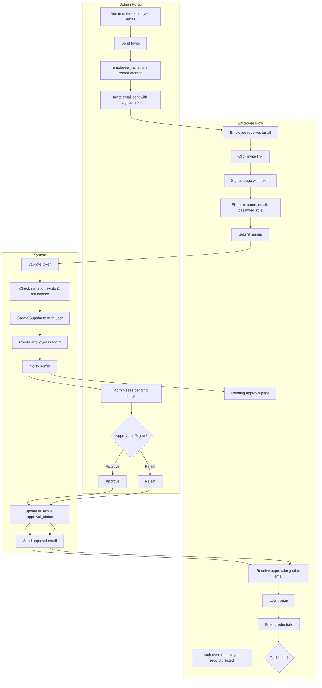
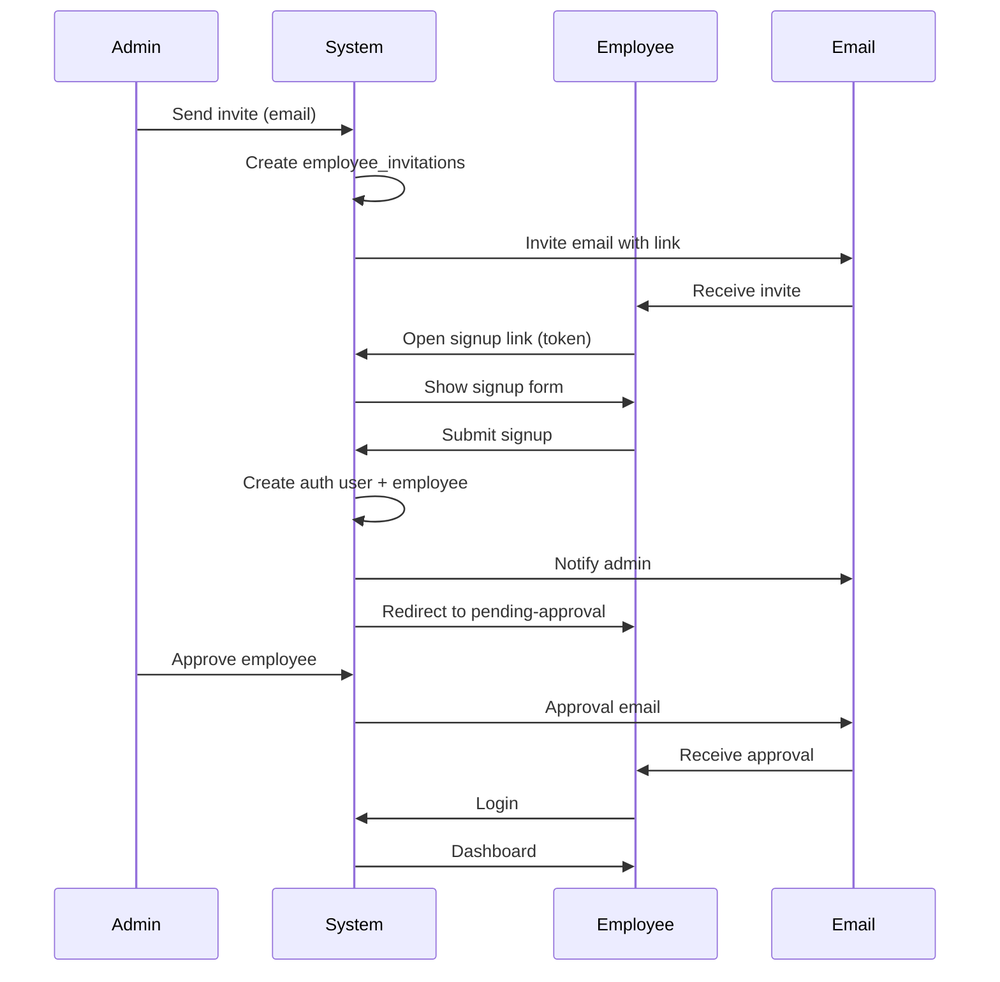

# Employee Portal – Authentication & Onboarding Flow

This document describes the invite-based signup, approval, and login flow for the Employee Portal.

---

## Overview

The Employee Portal uses an **invite-only signup** model:

1. Admin sends an invitation email to the employee
2. Employee signs up using the invite link
3. Account is created with **pending approval**
4. Admin approves or rejects the request
5. Approved employees can log in

---

## Flow Diagram

---

## Detailed Step-by-Step Flow

### Phase 1: Admin Sends Invitation

| Step | Actor | Action | Result |
|------|-------|--------|--------|
| 1 | Admin | Opens Admin → Employees → "Induction Node" panel | Invite form is shown |
| 2 | Admin | Enters employee email and submits | System validates: email not already an employee, no pending invite |
| 3 | System | Creates `employee_invitations` record | `status: pending`, `expires_at: now + 1 day` |
| 4 | System | Sends invite email | Link: `{SITE_URL}/Employee_portal/signup?token={invite_token}` |

**Database:** `employee_invitations` table  
- `email`, `invite_token`, `status`, `expires_at`

---

### Phase 2: Employee Signup (Invite Link Required)

| Step | Actor | Action | Result |
|------|-------|--------|--------|
| 1 | Employee | Clicks invite link in email | Lands on `/Employee_portal/signup?token=xxx` |
| 2 | System | Validates token via `validateInviteToken()` | Checks: token exists, `status=pending`, `expires_at > now` |
| 3a | System | Token valid | Signup form shown, email pre-filled |
| 3b | System | Token missing/invalid/expired | Error: "Invalid or expired invitation link" |
| 4 | Employee | Fills name, email (read-only), password, role | Form submitted |
| 5 | System | Validates invite token, email match | Creates Supabase Auth user (email auto-confirmed) |
| 6 | System | Creates `employees` record | `is_active: false`, `approval_status: pending` |
| 7 | System | Updates invitation | `employee_invitations.status = accepted` |
| 8 | System | Sends admin notification email | Admin notified of new pending employee |
| 9 | System | Redirects employee | `/Employee_portal/pending-approval` |

**Database:** `auth.users` (Supabase Auth), `employees` table

---

### Phase 3: Pending Approval

| Step | Actor | Action | Result |
|------|-------|--------|--------|
| 1 | Employee | Sees pending approval page | Message: "An administrator will review your request" |
| 2 | Admin | Opens Admin → Employees | Sees pending employees list |
| 3 | Admin | Clicks Approve or Reject | Action executed |
| 4 | System | Updates `employees` | `is_active`, `approval_status` |
| 5 | System | Sends approval/rejection email | Employee notified |

---

### Phase 4: Employee Login

| Step | Actor | Action | Result |
|------|-------|--------|--------|
| 1 | Employee | Visits `/Employee_portal/login` | Login form shown |
| 2 | Employee | Enters email and password | Form submitted |
| 3 | System | Supabase Auth sign-in | Validates credentials |
| 4 | System | Checks `employees` table | Must have record for auth user |
| 5a | System | `approval_status=pending` | Sign out, redirect with `error=pending_approval` |
| 5b | System | `approval_status=rejected` | Sign out, redirect with `error=account_rejected` |
| 5c | System | `is_active=true`, `approval_status=approved` | Redirect to `/Employee_portal` (Dashboard) |

---

## Login Error States

| Error Param | Message |
|-------------|---------|
| `missing_fields` | Please fill in all required fields. |
| `invalid_credentials` | Invalid email or password. |
| `pending_approval` | Your account is pending admin approval. Please wait for approval. |
| `account_rejected` | Your account request was rejected. Please contact your administrator. |
| `not_employee` | You are not registered as an employee. Please use the correct login portal. |

---

## Signup Error States

| Error Param | Message |
|-------------|---------|
| `missing_fields` | Please fill in all fields |
| `invalid_invite` | Invalid or expired invitation link. Please contact your admin. |
| `already_exists` | An account with this email already exists |
| `creation_failed` | Failed to create account. Please try again. |
| `auth_failed` | (Redirects with auth_failed) |

---

## Key Routes

| Route | Purpose |
|-------|---------|
| `/Employee_portal/login` | Employee login |
| `/Employee_portal/signup?token=xxx` | Employee signup (token required) |
| `/Employee_portal/pending-approval` | Post-signup, waiting for admin approval |
| `/Employee_portal` | Dashboard (requires approved session) |
| `/admin/employees` | Admin: manage employees, send invites, approve/reject |

---

## Database Tables

### `employee_invitations`
| Column | Description |
|--------|-------------|
| `id` | UUID primary key |
| `email` | Invited email |
| `invite_token` | Unique token for signup URL |
| `status` | `pending` \| `accepted` |
| `expires_at` | Default: `now + 1 day` |

### `employees`
| Column | Description |
|--------|-------------|
| `id` | Same as `auth.users.id` |
| `name`, `email`, `role` | Employee info |
| `is_active` | `true` when approved |
| `approval_status` | `pending` \| `approved` \| `rejected` |

---

## Email Notifications

| Email | Trigger | Recipient |
|-------|---------|-----------|
| Invite email | Admin sends invite | Employee |
| Admin notification | Employee completes signup | Admin |
| Approval email | Admin approves | Employee |
| Rejection email | Admin rejects | Employee |

---

## Sequence Diagram (Simplified)

